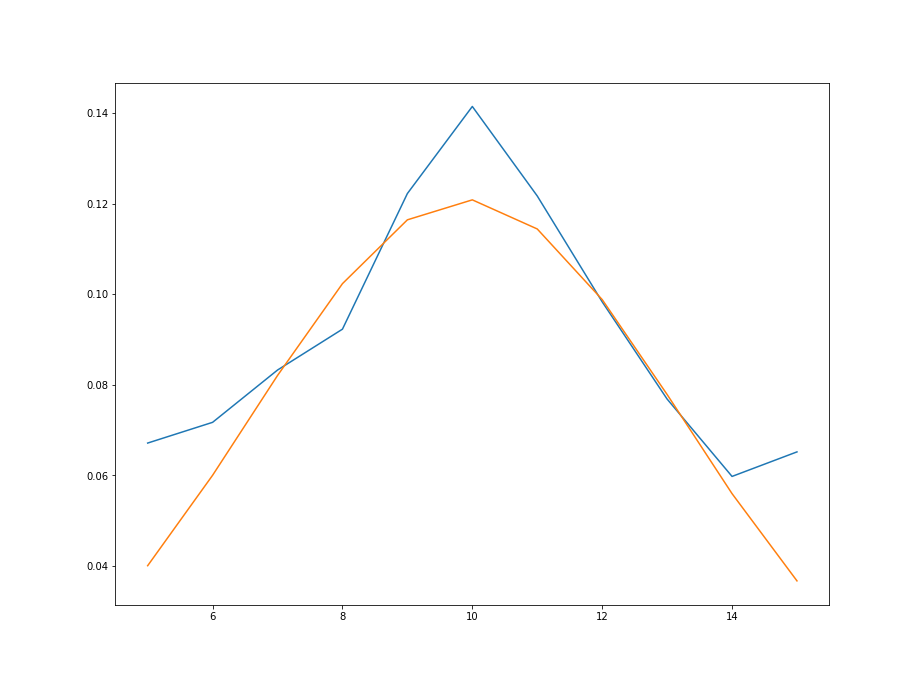
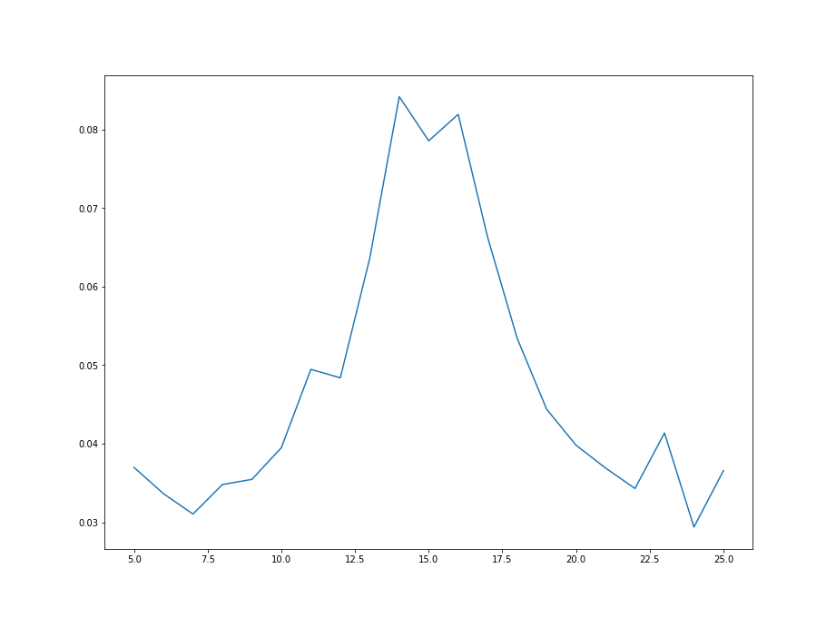

# Tarea3
Solución tarea 3 B63761
=======================

1) A partir de los datos, encontrar la mejor curva de ajuste (modelo probabilístico) para las funciones de densidad marginales de X y Y.

Se obtiene que apartir de los datos obtenidos curvas del tipo gaussiana para las funciones de densidad marginales de X y Y, a apartir de dichas curvas de ajuste, se obtiene a través de la curva de mejor ajuste los siguiente parámetros para fx mu = 9.90484381 y sigma = 3.29944287 y para fy mu = 15.0794609 y sigma = 6.02693776.

2) Asumir independencia de X y Y, ¿cuál es entonces la función de densidad conjunta que modela los datos?

Luego de asumir independeicia de X y Y, a partir de los parámetros obtenidos en el inciso anterior, se implementa para la función fx los parámetros son mu=9.90484381 y sigma = 3.29944287 y para la función fy , se utilizan los siguientes parámetoros mu = 15.0794609 y sigma = 6.02693776, con base en lo comentado se prodece a obtener de manera analítica la función de densidad conjunta que modela los datos, con base en lo anterior se obtiene el siguiente resultado obtenido de manera analítica:

3) Hallar los valores de correlación, covarianza y coeficiente de correlación (Pearson) para los datos y explicar su significado.

*Correlación: Se obtiene que E[xy]  = 149.54281000000012

*Covarianza: Se obtiene que Cxy  = 149.54281000000012

*Coeficiente de correlación (Pearson):

4) Graficar las funciones de densidad marginales (2D), la función de densidad conjunta (3D).
A continuación se muestrán las funciones de densidad marginales (2D)

En la imagen de la Figura 1, se observa la función de densidad marginal de fx obtenida de los datos reales.

En la imagen de la Figura 2, se observa la superposición entre la función de densidad marginal de fx con la curva de mejor ajuste para fx.

En la imagen de la Figura 3, se observa la función de densidad marginal de fy obtenida de los datos reales.

En la imagen de la Figura 4, se observa la superposición entre la función de densidad marginal de fy con la curva de mejor ajuste para fy.

En la imagen de la Figura 5, se observa la función de densidad conjunta obtenida a partir de los parámetros de la curva de mejor ajuste para fx y fy .

